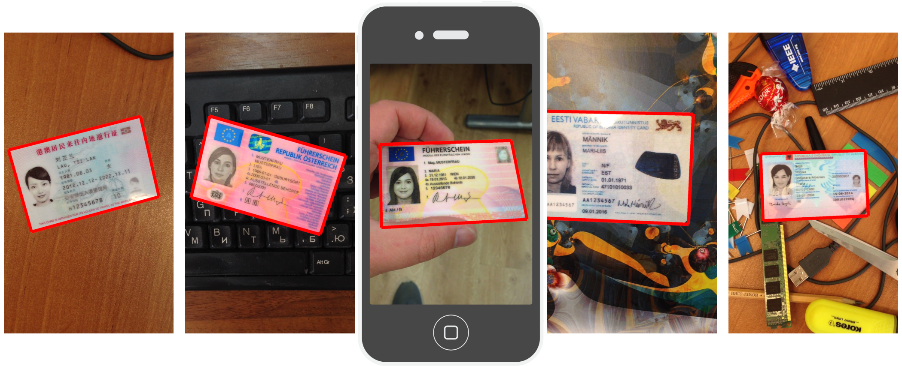

[](https://badge.fury.io/py/craft-text-detector)


## Download and convert MIDV-500 dataset into COCO instance segmentation format
Automatically download/unzip MIDV-500 dataset and convert the annotations into COCO instance segmentation format.

Then, dataset can be directly used in the training of Yolact, Detectron type of models.

 **Package maintainer: Fatih Cagatay Akyon**


## MIDV-500 Dataset
MIDV-500 consists of 500 video clips for 50 different identity document types with ground truth which allows to perform research in a wide scope of various document analysis problems.



You can find more detail on: [MIDV-500: A Dataset for Identity Documents Analysis and Recognition on Mobile Devices in Video Stream](https://arxiv.org/abs/1807.05786)


## Getting started
### Installation
```console
pip install midv500
```

### Usage
```python
# import package
import midv500

# set directory for dataset to be downloaded
dataset_dir = 'data/midv500/'

# download and unzip midv500 dataset
midv500.download_dataset(dataset_dir)

# set directory for coco annotations to be saved
export_dir = 'data/midv500/'

# convert midv500 annotations to coco format
midv500.convert_to_coco(dataset_dir, export_dir)
```

